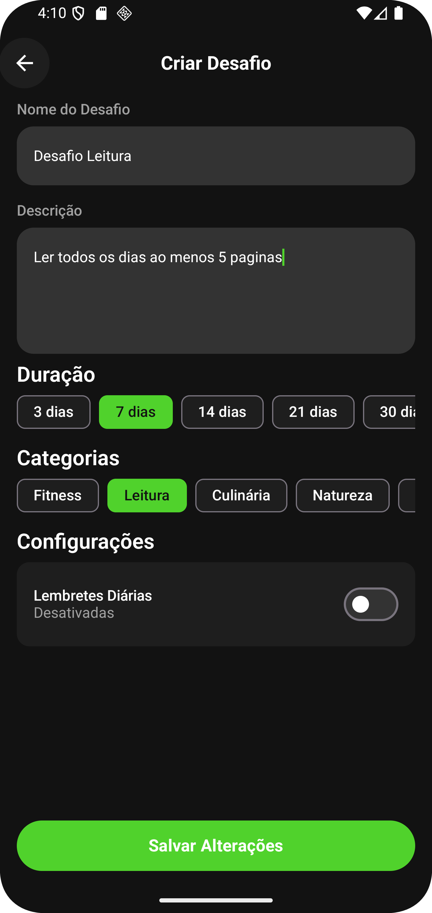

# 🌟 Minha Jornada  

Aplicativo de hábitos e metas pessoais desenvolvido em Kotlin com Jetpack Compose. Gerencie seus objetivos, receba lembretes inteligentes e acompanhe seu progresso diário de forma motivadora.  

> ⚠️ Este app ainda **não está publicado na Play Store**. Você pode rodá-lo localmente pelo Android Studio.  

---

## 🖼️ Galeria de Telas

| Tela Inicial | Comunidade | Criar Desafios |
|--------------|------------|----------------|
|  |  |  |

| Explorar | Feed da Comunidade | Perfil |
|----------|--------------------|--------|
|  |  |  |

| Lembretes | Criar Lembrete | Desafio |
|-----------|----------------|---------|
|  |  |  |

| Atualizar Progresso | Postagem na Comunidade | 
|---------------------|------------------------|
|  |  |
---

## ✅ Funcionalidades  

- [x] Criação e gerenciamento de hábitos personalizados  
- [x] Comunidades para se incentivar
- [x] Desafios públicos
- [x] Lembretes inteligentes (diários, semanais, personalizados)  
- [x] Acompanhamento visual do progresso  
- [x] Sincronização com Firebase  

---

## 🚀 Próximos Passos  

- [ ] Implementar notificações push  
- [ ] Adicionar desafios em grupo  
- [ ] Criar sistema de conquistas  
- [ ] Desenvolver testes automatizados  

---

## 🛠️ Tecnologias  

- **Linguagem**: Kotlin  
- **UI**: Jetpack Compose  
- **Arquitetura**: MVVM + Clean Architecture  
- **Estado**: StateFlow  
- **Banco de Dados**: Firebase  
- **DI**: Koin  

---

- 🔗 [Meu linkedin](https://www.linkedin.com/in/devandroidlucas/)

---

## 👤 Desenvolvedor

Lucas Silva Sousa  
📧 lucasssilva021@gmail.com  
🌐 Desenvolvedor Android | Kotlin | Compose
